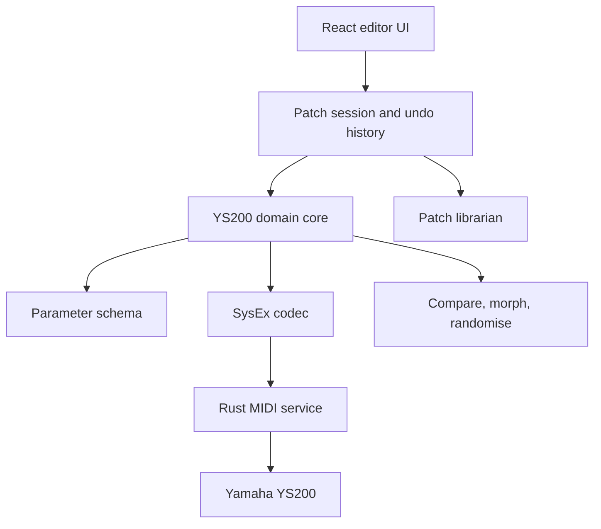

# YS200 Editor — Architecture Plan

## Goal

Build a native editor and patch librarian for the Yamaha YS200. The interface should be a close visual tribute to the original Atari ST YSEDITOR: monochrome, pixelated lettering, dithered fills, compact vertical sliders, four operator envelopes across the middle, and rectangular command buttons. Preserve that visual language as reliable SysEx communication, patch comparison, and patch management are implemented. Avoid modern dashboard cards, rounded controls, color accents, and hardware-style knobs.

The first version should concentrate on editing and managing YS200 voices. Synth emulation, sequencing, cloud synchronisation, and plug-in formats are deliberately outside the initial scope.

## Recommended stack

| Area | Technology | Purpose |
| --- | --- | --- |
| Desktop shell | Tauri 2 | Native macOS application with a straightforward path to Windows and Linux |
| Interface | React and TypeScript | Fast UI development and reusable visual controls |
| Native layer | Rust | MIDI ports, SysEx transport, device communication, and filesystem integration |
| Editor state | Zustand and Immer | Patch sessions, undo/redo, selections, and connection state |
| Patch storage | SQLite | Searchable local librarian and patch metadata |
| Tests | Vitest plus Rust tests | Codec fixtures, round-trip guarantees, state logic, and MIDI protocol tests |

## Architectural principle

Keep the YS200 knowledge independent from the interface and MIDI implementation.

> The raw bytes are the evidence, the typed patch is our understanding, and the UI is one way of manipulating it.

This separation allows the SysEx mapping to evolve as the instrument is reverse-engineered without requiring the editor UI to be rewritten.



## 1. YS200 domain core

The domain core contains the application's knowledge of a YS200 voice. It must not depend on React, Tauri, MIDI ports, or the database.

An initial semantic model could resemble:

```ts
type Voice = {
  name: string
  algorithm: number
  feedback: number
  operators: [Operator, Operator, Operator, Operator]
  pitchEnvelope: PitchEnvelope
  lfo: Lfo
}
```

`Voice` represents the YS200 voice edit buffer only. Performance, multi, system,
and global-effect data must be separate document types and may be linked by the
session or librarian; they must not be silently folded into a voice.

During reverse-engineering, the editor should retain the original byte image alongside the interpreted model:

```ts
type PatchDocument = {
  voice: Voice
  // Exact received 7-bit payload bytes, excluding the SysEx framing and checksum.
  originalPayload?: Uint8Array
  // Payload offsets not yet semantically interpreted; always a subset of originalPayload.
  unknownBytes: Record<number, number>
  schemaVersion: number
}
```

This lets the application modify understood parameters without destroying bytes whose meanings have not yet been documented.

Encoding starts from `originalPayload`, writes only the edited, understood fields,
then constructs the SysEx framing and a newly calculated checksum. An unchanged
decoded dump must reproduce its original complete SysEx message byte-for-byte.
This is the preservation invariant and needs to be shared by every codec.

The core should expose pure operations such as:

```ts
decodeVoiceDump(bytes): PatchDocument
encodeVoiceDump(document): Uint8Array
setParameter(document, path, value): PatchDocument
diffVoices(a, b): ParameterDifference[]
validateVoice(document): ValidationIssue[]
```

Pure functions make the codec easy to test against captured SysEx dumps without connecting a synthesizer.

## 2. Declarative parameter schema

The prototype audit and confirmed visible ranges are in `PARAMETER_AUDIT.md` and `app/ys200.js`. The example below illustrates schema structure; its addresses/transforms are placeholders and must not be used as protocol facts.

Describe each editable parameter once in a central schema:

```ts
{
  id: "operator.1.detune",
  label: "Detune",
  group: "operator",
  range: [-3, 3],
  defaultValue: 0,
  dump: { payloadOffset: 42, mask: 0x0f, shift: 0, decode: "signed-nibble" },
  display: "signed",
  realtime: { group: 4, subgroup: 2, parameter: 42, encode: "packed-byte" }
}
```

The schema can drive:

- Valid ranges and defaults
- Control labels and value formatting
- SysEx packing and unpacking
- Validation
- Documentation and tooltips
- Patch comparison
- Constrained randomisation
- Future MIDI-controller mapping
- Future automation and macros

The interface should still be deliberately designed rather than rendered as a generic form. The schema supplies consistent behaviour; the UI supplies layout, hierarchy, and character.

## 3. Native MIDI service

Rust should own all native MIDI activity:

- Port discovery and connection lifecycle
- Separate input and output selection
- SysEx send and receive
- Yamaha device-number handling
- Dump requests and responses
- Checksums and SysEx framing
- Request-response timeouts
- Message logging and diagnostics
- Throttling rapid parameter updates
- Coalescing obsolete knob movements

The interface should issue semantic commands rather than construct MIDI packets:

```ts
type DeviceCommand =
  | { type: "request-edit-buffer" }
  | { type: "send-edit-buffer"; bytes: Uint8Array }
  | { type: "change-parameter"; revision: number; group: number; subgroup: number; parameter: number; value: number }
```

Live parameter change is the normal editing path, not an optional enhancement. The
YS200 accepts per-parameter SysEx for the voice edit buffer (VCED), additional
voice data (ACED/ACED2), and effect data. Each schema entry must therefore contain
both its dump-byte transform and its live parameter address/transform. Where a
parameter occupies bits in a shared byte, the codec performs read-modify-write and
sends the merged byte value.

Commands should pass through a serial queue with revision-aware barriers. A full
edit-buffer send must invalidate or precede stale live changes so an old knob event
cannot overwrite a newer complete patch. Coalesce only obsolete changes to the same
parameter; never coalesce across a send, request, or explicit receive boundary.
Older hardware may fail when SysEx messages arrive too quickly, so the throttle
interval must be measured on real hardware and centrally configurable.

The service should publish events for connection changes, received dumps, writes
sent, request timeouts, and unexpected MIDI messages. Do not treat a transmitted
message as an acknowledged hardware change: confirmation is a subsequently
requested and decoded edit-buffer dump.

## 4. Patch session

The patch session coordinates editing without becoming hardware-specific:

```ts
type PatchSession = {
  document: PatchDocument
  lastReceived: PatchDocument | null
  lastSent: PatchDocument | null
  revision: number
  selectedPart: number
  dirty: boolean
  syncState: "offline" | "synced" | "pending" | "unconfirmed" | "conflict"
}
```

It should provide:

- Undo and redo
- Dirty-state tracking
- Autosave and crash recovery
- A/B snapshots
- Revert to last received state
- Send entire patch
- Live per-parameter editing, with a clearly visible pending/unconfirmed state
- Offline editing while the instrument is disconnected
- Explicit handling when the hardware and editor diverge

The UI updates immediately for responsiveness while the MIDI queue synchronises the
hardware in the background. A sent value is optimistic until a later edit-buffer
read confirms it. Errors must leave the editor state intact and visibly mark the
session as unconfirmed or unsynchronised.

## 5. Patch librarian

SQLite should store searchable metadata and canonical imported SysEx bytes. The
normalised parameter JSON is a derived, schema-versioned index: it may always be
discarded and regenerated from the raw data as the reverse-engineered mapping grows.

Suggested patch fields:

- Stable UUID
- Patch name
- Raw SysEx
- Normalised parameter JSON
- Tags
- Rating or favourite flag
- Notes
- Source bank, file, or device
- Creation and import dates
- Parent patch for variations
- Optional generated operator-diagram thumbnail

Supported workflows should eventually include:

- Import individual `.syx` voices
- Import bank dumps
- Receive patches from the YS200
- Drag and drop files
- Export standard SysEx
- Save an editor-native `.ysvoice` document

The native document should contain the semantic model, original payload bytes,
unknown bytes, and a format version. SysEx remains the hardware interchange format.

## 6. Interface modes

Both interface modes operate on the same patch session.

### Classic view

A characterful overview inspired by YSEDITOR PLUS:

- Operators arranged around the selected algorithm
- Coloured envelope displays
- Chunky late-1980s/early-1990s controls
- An LCD-inspired patch header
- As much useful information on one screen as practical

### Explore view

A more spacious modern sound-design environment:

- Large draggable envelopes
- Algorithm signal-flow display
- Operator mute and solo
- Carrier and modulator highlighting
- Parameter search
- Patch-difference overlays
- Safe randomisation
- Morphing between two patches
- User-defined macros
- Velocity, modulation, breath-control, and aftertouch routing overview

Classic and Explore are alternative projections of the same data, not separate editors.

## Repository layout

```text
ys200-editor/
  apps/
    desktop/             React and Tauri application
  packages/
    ys200-core/          Patch types, schema, and transformations
    ys200-sysex/         Encoding, decoding, and checksums
    editor-ui/           Reusable visual controls
    patch-library/       Database-facing application logic
  src-tauri/
    midi/                Native MIDI transport
    commands/            Tauri command boundary
  fixtures/
    sysex/               Captured and known patch dumps
    roundtrip/           Expected decoded representations
  docs/
    sysex-map/           Reverse-engineering notes and byte maps
```

`ys200-core` and `ys200-sysex` can begin as one package if they contain only a handful of files. Preserve the logical boundary without creating unnecessary package ceremony.

## First vertical slice

The first milestone should prove the complete path between hardware, domain model, UI, and disk:

1. Discover and select MIDI input and output ports.
2. Request the current edit-buffer voice.
3. Receive and capture the raw SysEx message.
4. Decode it without losing unknown bytes.
5. Display the patch name, algorithm, and one operator.
6. Change one confirmed parameter live on the YS200 using its documented parameter-change address.
7. Send and receive the complete patch.
8. Save the patch and reopen it.
9. Prove byte-for-byte round-tripping with fixture tests.

This milestone establishes the risky parts early. Adding the remaining known parameters should then be largely schema and interface work.

## Testing strategy

### Codec tests

- Decode captured SysEx into expected values.
- Encode an unchanged document back to identical bytes.
- Preserve every unknown byte.
- Reject invalid sizes, headers, values, and checksums.
- Test minimum and maximum values for every known parameter.

### Domain tests

- Parameter changes are immutable and reversible.
- Undo and redo restore exact values.
- Diff output correctly identifies semantic changes.
- Randomisation never exceeds valid ranges.

### MIDI tests

- Use a mock transport for most automated tests.
- Record sent and received messages in a diagnostic console.
- Test queue ordering, throttling, retries, and disconnects.
- Test revision barriers: stale coalesced live writes must never cross a full-dump send or receive request.
- Test packed-byte live writes preserve sibling bit fields.
- Keep real-hardware smoke tests as a small documented checklist.

### Fixture policy

Never alter a captured raw dump merely to make a test pass. Captures are source evidence. Add interpretation around them and document where each fixture came from.

## Decisions to postpone

- Synth-engine emulation and in-app audio preview
- Sequencer editing
- AU, VST, or CLAP plug-in builds
- Cloud accounts and synchronisation
- A general-purpose multi-synth framework
- Mobile or browser-only versions

Clean package boundaries leave some of these possible later, but the initial product should be a particularly good YS200 editor rather than an unfinished universal platform.

## Suggested implementation phases

### Phase 0 — Protocol evidence

- Collect manuals, MIDI implementation charts, known editors, and SysEx captures.
- Create a byte-map document that distinguishes confirmed, inferred, and unknown fields.
- Capture controlled before-and-after dumps for individual parameter changes.

### Phase 1 — Communication spike

- Scaffold Tauri, React, and Rust.
- List and connect MIDI ports.
- Build the message monitor.
- Receive, save, and resend raw SysEx safely.

### Phase 2 — First editable voice

- Implement the raw-plus-semantic patch document.
- Decode confirmed global and operator fields.
- Build fixture-based round-trip tests.
- Complete the first vertical slice.

### Phase 3 — Complete voice editor

- Expand the parameter schema.
- Build Classic and Explore views.
- Add envelopes, algorithm diagrams, live editing, and robust sync state.

### Phase 4 — Librarian and creative tools

- Add SQLite storage, search, tags, import, and export.
- Add patch comparison, A/B snapshots, constrained randomisation, morphing, and macros.

### Phase 5 — Packaging

- Add application signing and release builds.
- Test on current Intel and Apple Silicon Macs where available.
- Add Windows support after the macOS workflow is reliable.

## Immediate next action

Start with Phase 0 and one very small communication spike. Before designing the complete interface, obtain at least two known YS200 voice dumps that differ in exactly one parameter. Those captures will validate the byte map, codec shape, and preservation strategy on which the rest of the application depends.
